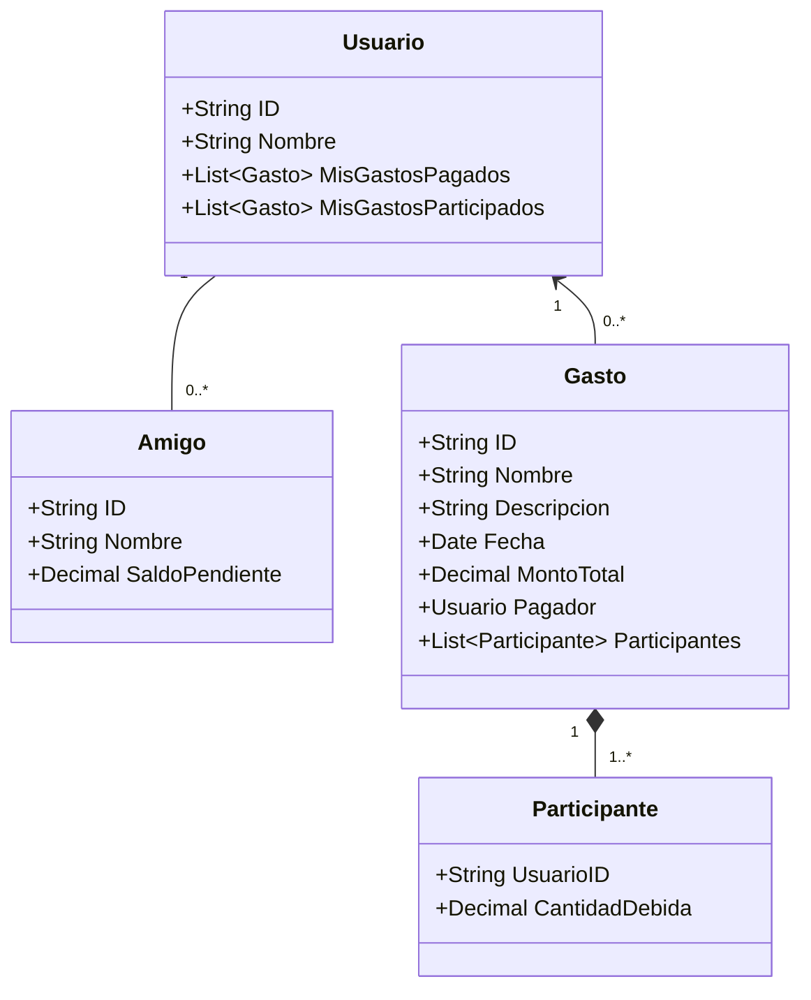
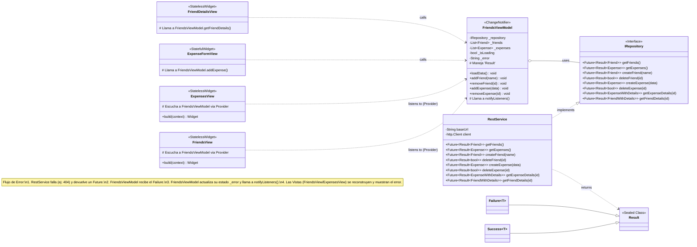

``` mermaid
graph TD
    A(Inicio) --> B(Ver Pantalla 'Friends' );
    B --> C{Acción del Usuario};
    C -- Clic 'EXPENSES' [cite: 21] --> D(Ver Pantalla 'Expenses' [cite: 54-65]);
    C -- Clic 'SHOW ALL' Amigo [cite: 12] --> E(Ver Detalle Amigo (UC-07) [cite: 38-44]);
    E --> B;
    
    D --> F{Acción del Usuario};
    F -- Clic 'FRIENDS'  --> B;
    F -- Clic 'SHOW ALL' Gasto [cite: 57] --> G(Ver Detalle Gasto (UC-05) [cite: 83-89]);
    G --> D;
    
    F -- Clic '+'  --> H(Ver Pantalla 'Crear Gasto' (UC-02) );
    H -- Rellenar Formulario  --> I(Clic 'CONFIRMAR' );
    I -- Gasto Creado  --> D;
    I -- Error Creación (A1, A2)  --> H;

    %% Flujo implícito de Edición/Borrado
    G -- Clic 'Editar' (Implícito, UC-03) --> J(Ver Pantalla 'Modificar Gasto' (UC-03) );
    J -- Clic 'CONFIRMAR' [cite: 133] --> K(Gasto Modificado [cite: 156]);
    K --> D;
    G -- Clic 'Eliminar' (Implícito, UC-04) --> L(Confirmar Eliminación [cite: 158]);
    L -- OK --> M(Gasto Eliminado [cite: 158]);
    M --> D;
    L -- Cancelar --> G;
 ```
``` mermaid
sequenceDiagram
    actor User as Usuario
    participant FormView as ExpenseFormView (UI)
    participant ViewModel as FriendsViewModel (State)
    participant Service as IRepository (RestService)
    participant API as Servidor Backend

    User ->> FormView: Rellena formulario y pulsa "Guardar"
    FormView ->> ViewModel: addExpense(data)
    
    ViewModel ->> ViewModel: _isLoading = true
    ViewModel ->> ViewModel: notifyListeners()
    activate ViewModel
    FormView ->> FormView: Muestra CircularProgressIndicator
    
    ViewModel ->> Service: createExpense(data)
    activate Service
    
    Service ->> API: HTTP POST /expenses (json=data)
    activate API
    
    alt Flujo de Éxito
        API -->> Service: Responde 201 Created (json=new_expense)
        deactivate API
        Service -->> ViewModel: return Success(new_expense)
        deactivate Service
        
        ViewModel ->> ViewModel: _expenses.add(new_expense)
        ViewModel ->> ViewModel: _isLoading = false
        ViewModel ->> ViewModel: _error = ""
        ViewModel ->> ViewModel: notifyListeners()
        deactivate ViewModel
        
        FormView ->> FormView: Cierra la vista (Navigator.pop)
        
    else Flujo de Error del Servidor (ej: 422)
        API -->> Service: Responde 422 (json={"detail": "Validación fallida"})
        deactivate API
        Service -->> ViewModel: return Failure("Error: Validación fallida")
        deactivate Service
        
        ViewModel ->> ViewModel: _isLoading = false
        ViewModel ->> ViewModel: _error = "Error: Validación fallida"
        ViewModel ->> ViewModel: notifyListeners()
        deactivate ViewModel
        
        FormView ->> FormView: Muestra SnackBar/Dialog con el mensaje de error
    end
```