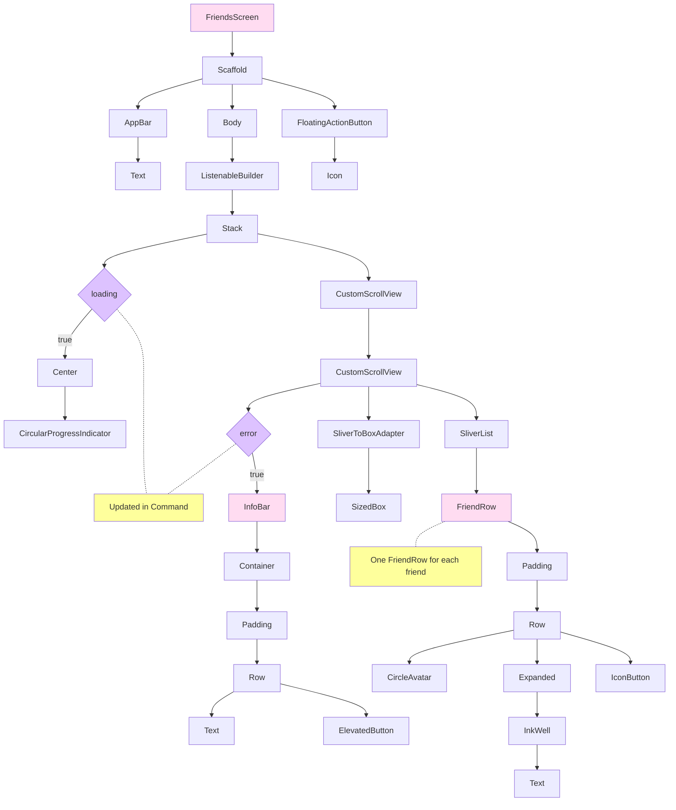
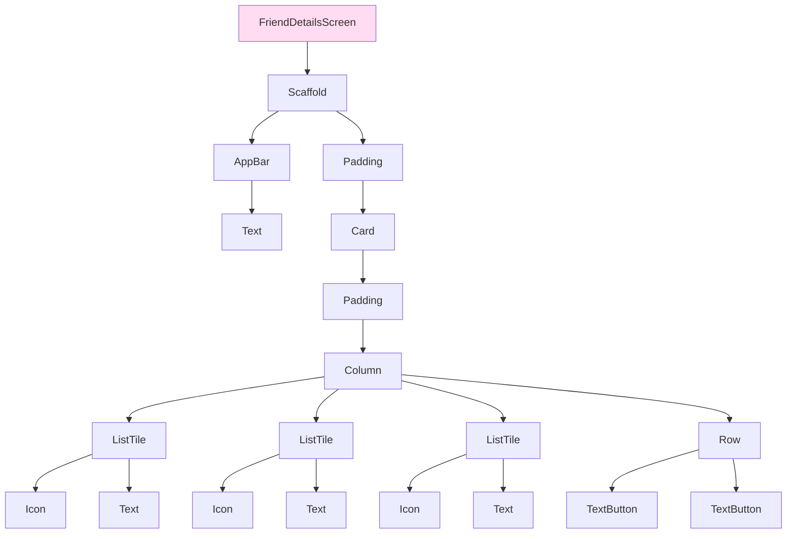
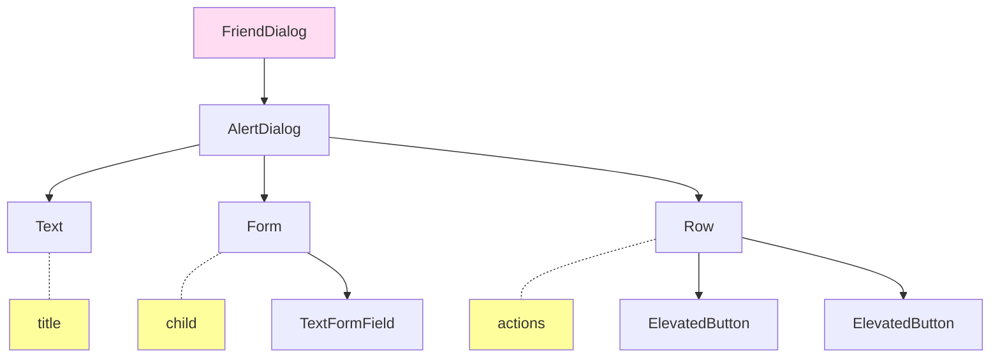

# IU design

## Hierarchy of widgets in FriendsScreen

```mermaid
graph TD

%% ROOT
A[FriendsScreen] --> B[Scaffold]
B --> C[AppBar]
B --> D[Body]
B --> E[FloatingActionButton]

%% APPBAR
C --> C1[Text]

%% BODY
D --> D1[ListenableBuilder]
D1 --> D2[Stack]

D2 --> D21{loading}

D21 -.- DN1[Updated in Command]


%% STACK CHILDREN
D21 -- true --> D3[Center]
D3 --> D31[CircularProgressIndicator]
%%D2 --> D4[Conditional: friends.isEmpty ? Center(Text "No friends") : CustomScrollView]
D2 --> D4[CustomScrollView]

%% SCROLL VIEW WHEN FRIENDS EXIST
D4 --> D5[CustomScrollView]
D5 --> D6{error}
D6 -- true --> D61[InfoBar]
D5 --> D7[SliverList]
D5 --> D8[SliverToBoxAdapter]
D8 --> D81[SizedBox]

D6 -.- DN1

%% INFOBAR CONTENT
D61 --> D6A[Container]
D6A --> D6B[Padding]
D6B --> D6C[Row]
D6C --> D6D[Text]
D6C --> D6E[ElevatedButton]

%% FRIENDROW STRUCTURE
D7 --> D9[FriendRow]
D9 -.- DN2[One FriendRow for each friend]
D9 --> D9A[Padding]
D9A --> D9B[Row]
D9B --> D9C[CircleAvatar]
D9B --> D9D[Expanded]
D9D --> D9D1[InkWell]
D9D1 -->D9D11[Text]
D9B --> D9E[IconButton]

%% FLOATING ACTION BUTTON
E --> E1[Icon]


classDef pink fill:#ffdcf1;
classDef purple fill:#ddc2ff;
classDef yellow fill:#feff9c

class A,D9,D61 pink
class D6,D21 purple
class DN1,DN2 yellow
```

## Hierarchy of widgets in FriendDetailsScreen

```mermaid
graph TD

%% ROOT
A[FriendDetailsScreen] --> B[Scaffold]

%% APP BAR
B --> C[AppBar]
C --> C1[Text]

%% BODY
B --> D[Padding]
D --> E[Card]

E --> F[Padding]
F --> G[Column]

%% COLUMN CHILDREN
G --> H1[ListTile]
G --> H2[ListTile]
G --> H3[ListTile]
G --> H4[Row]

H1 --> I11[Icon]
H1 --> I12[Text]

H2 --> I21[Icon]
H2 --> I22[Text]

H3 --> I31[Icon]
H3 --> I32[Text]


%% ROW CHILDREN
H4 --> I41[TextButton]
H4 --> I42[TextButton]

classDef pink fill:#ffdcf1;
class A pink

```

## Hierarchy of widgets in FriendDialog

```mermaid
graph TD

%% ROOT
A[FriendDialog] --> B[AlertDialog]


%% ALERT DIALOG CONTENT
B --> C[Text]
B --> D[Form]
B --> E[Row]
C -.- N1[title]
D -.- N2[child]
E -.- N3[actions]

%% FORM CONTENT
D --> D1[TextFormField]

%% ACTIONS ROW
E --> E1[ElevatedButton]
E --> E2[ElevatedButton]


classDef pink fill:#ffdcf1;
classDef yellow fill:#feff9c

class A pink
class N1,N2,N3 yellow
```