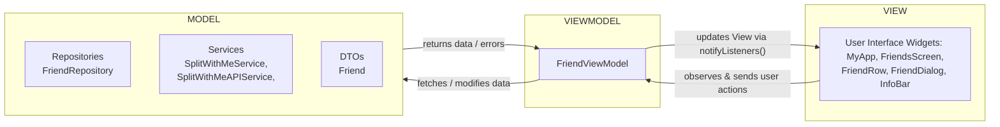
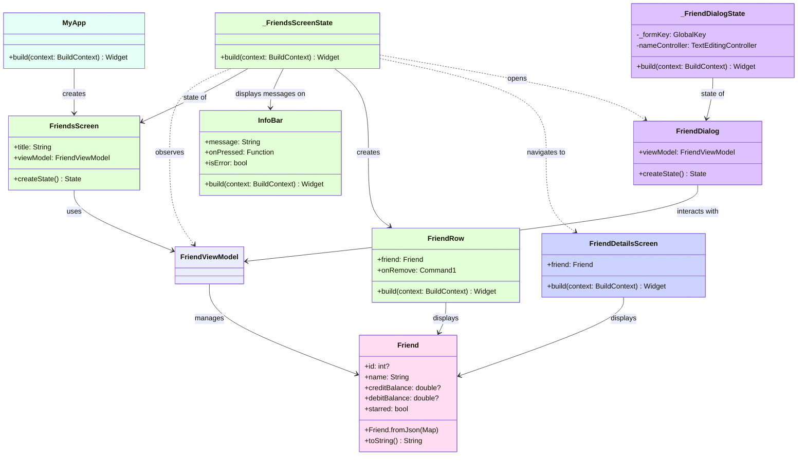
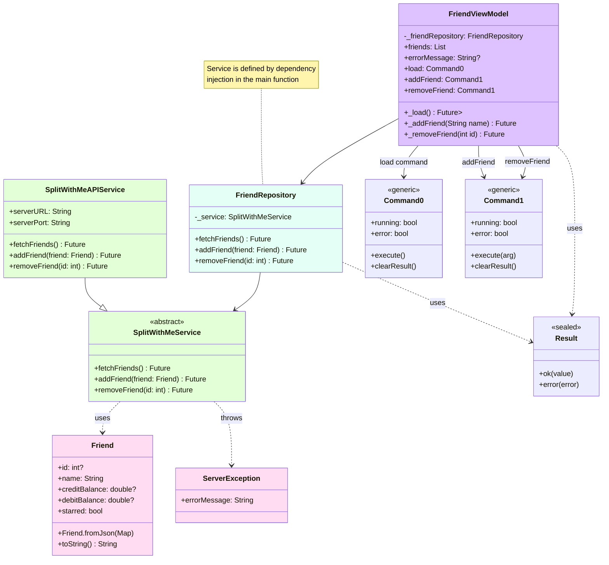
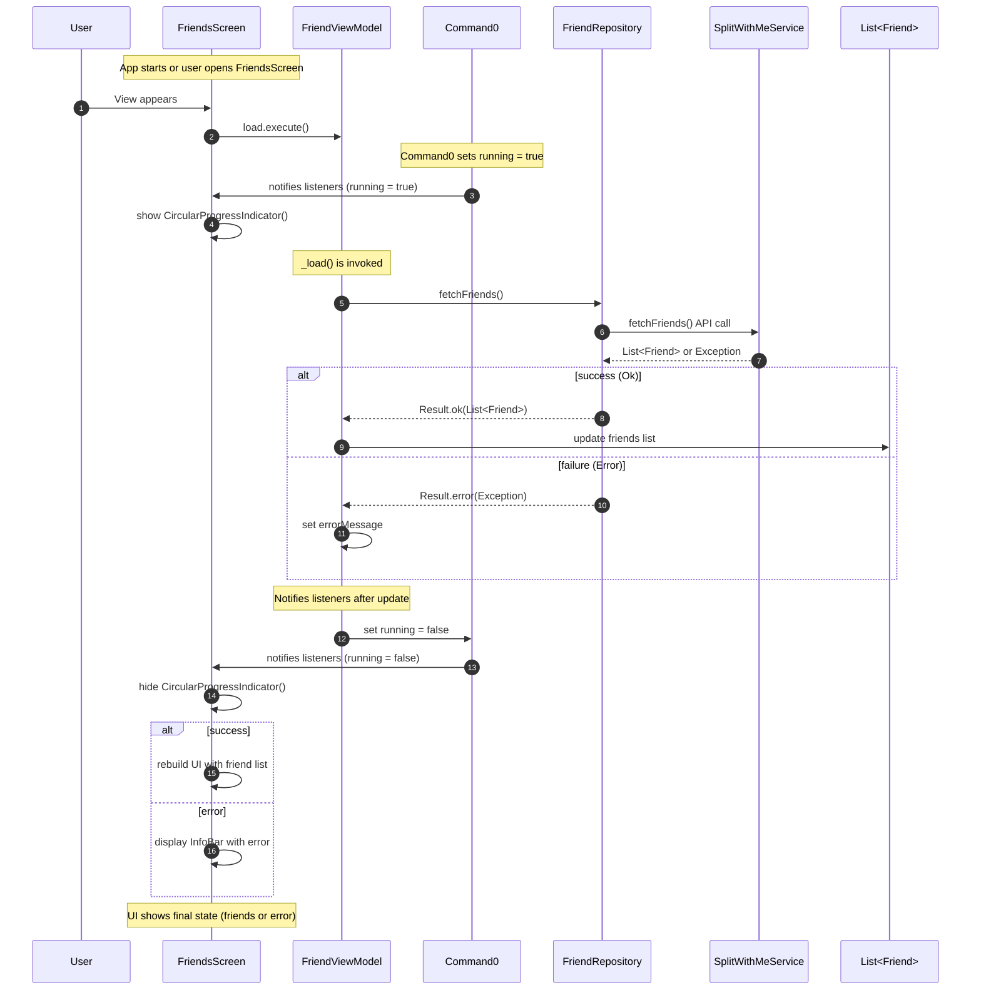
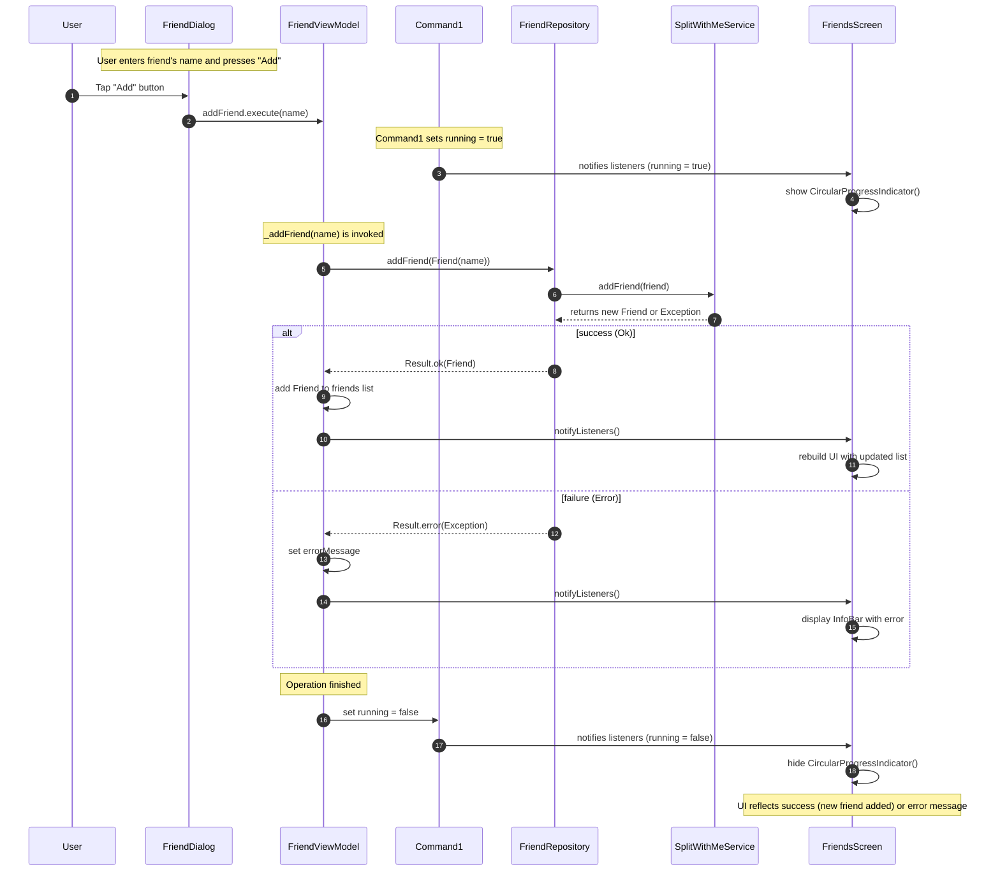
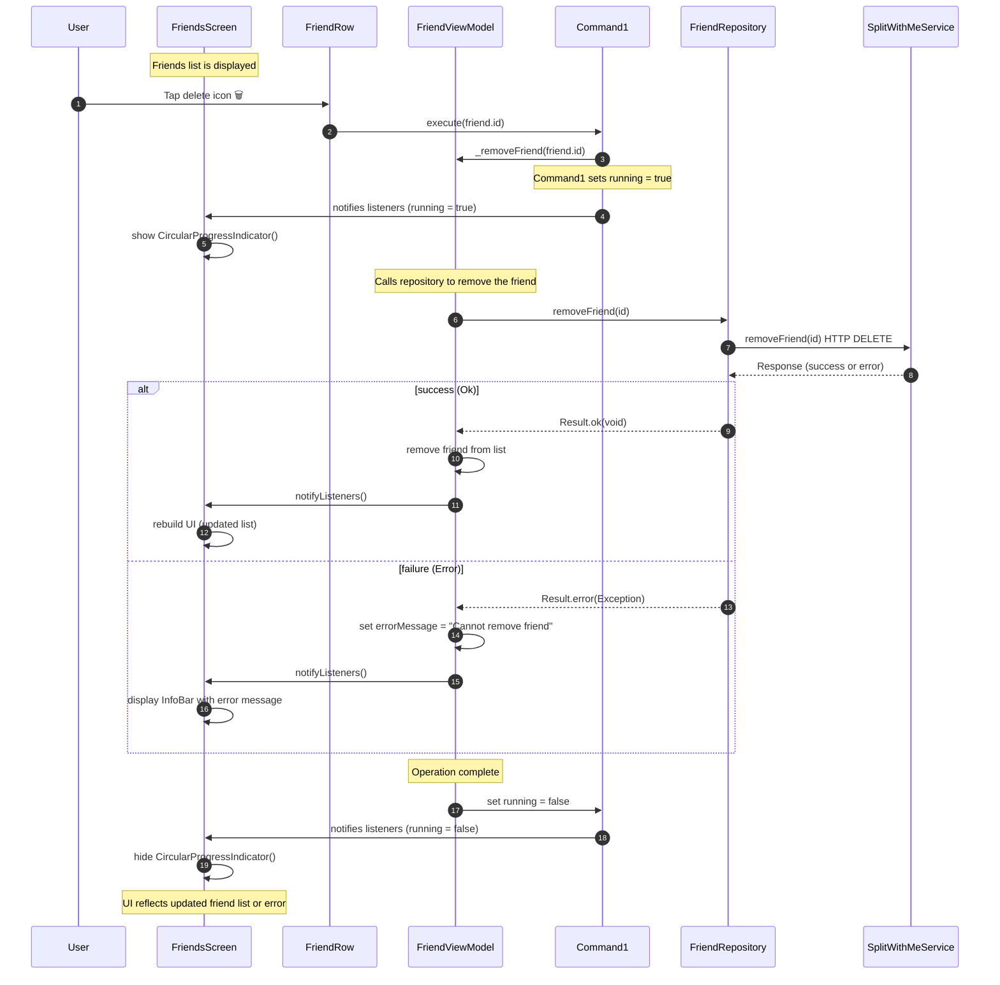

# MVVM pattern

## Flowchart

## Class Diagram: View

## Class diagram: ViewModels, Respositories and Services

## Sequence diagram: load list of friends

## Sequence diagram: add a new friend

## Sequence diagram: remove a friend

